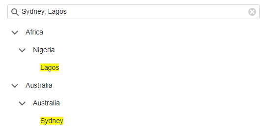

<!-- default badges list -->

<!-- default badges end -->

# Blazor TreeView – How to implement custom filter

This example shows how to implement a custom filter that reacts to the  TreeViewNode’s Text when it is split by a comma and applies custom highlighting.

 
 
The filter accepts the [NavigationFilterInfo](http://docs.devexpress.com/Blazor/DevExpress.Blazor.NavigationFilterInfo) structure to obtain the [FilterString](http://docs.devexpress.com/Blazor/DevExpress.Blazor.DxTreeView.FilterString) value and uses a regular expression to parse the filter string. The [NodeTextTemplate](http://docs.devexpress.com/Blazor/DevExpress.Blazor.DxTreeView.NodeTextTemplate) uses a regular expression to apply custom highlighting.

<!-- default file list -->

## Files to Look At

[Index.razor](CS/TreeViewCustomFilter/Pages/Index.razor)

<!-- default file list end -->

## Documentation

[TreeView - Filter Nodes](http://docs.devexpress.com/Blazor/DevExpress.Blazor.DxTreeView#filter-nodes)
